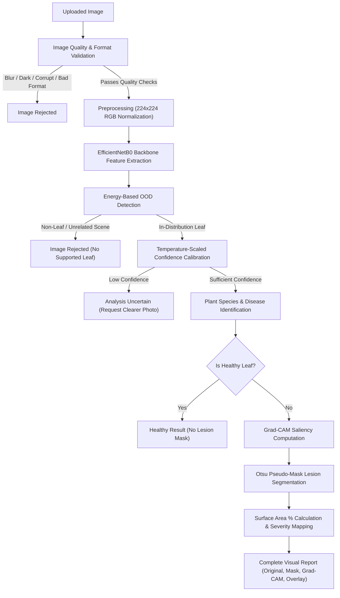

# LeafGuard AI 🌿

**Explainable Plant Disease Detection, Classification, Localization & Severity Analysis**

[](https://fastapi.tiangolo.com)
[](https://pytorch.org)
[](https://react.dev)
[](https://tailwindcss.com)
[](https://docker.com)

---

## 1. Overview

**LeafGuard AI** is a computer vision and deep learning web application built for automated plant pathology. Unlike traditional CNN demos that force every image into a disease category, LeafGuard AI implements a multi-stage validation and out-of-distribution (OOD) pipeline that rejects non-leaf objects (cars, animals, buildings, random scenes) and low-quality photos before providing evidence-based visual disease localization.

### Key Capabilities
- **Strict Image Validation**: Verifies MIME types, resolution, blur (Laplacian variance), contrast, and illumination boundaries.
- **Out-of-Distribution (OOD) Detection**: Energy-based free energy scoring ($S(x) = T \cdot \log \sum \exp(z_i/T)$) combined with calibrated probability to detect and reject non-agricultural objects.
- **Calibrated Disease Classification**: Two-stage fine-tuned **EfficientNet-B0** spanning **38 PlantVillage conditions** across **14 agricultural crop species** with temperature scaling for well-calibrated confidence scores.
- **Disease Localization & Segmentation**: Weakly-supervised lesion localization converting classifier attention maps via Otsu thresholding and morphological cleanup into pixel-level disease masks.
- **Severity Quantification**: Calculates affected leaf surface area percentage and maps it to agronomic severity classes (*Minimal*, *Mild*, *Moderate*, *Severe*).
- **Explainable AI (XAI)**: Generates high-resolution **Grad-CAM** saliency overlays directly highlighting the visual regions that influenced the model's prediction.
- **Dedicated Model Performance Dashboard**: Transparently surfaces real evaluation metrics, latency profiles (Mean, P50, P95), and 38-class confusion matrices.

---

## 2. Architecture & Inference Pipeline



---

## 3. Tech Stack

### Backend
- **Framework**: Python 3.12, FastAPI, Uvicorn
- **Deep Learning / Vision**: PyTorch, Torchvision, OpenCV (`opencv-python-headless`), PIL, `pytorch-grad-cam`
- **Machine Learning & Stats**: `scikit-learn`, `numpy`, `scipy`
- **Validation & Serialization**: `pydantic v2`, `pydantic-settings`, `filetype`
- **Experiment Tracking**: `mlflow`

### Frontend
- **Framework**: React 18, TypeScript, Vite
- **Routing**: `react-router-dom` v6
- **Styling**: Tailwind CSS (clean, restrained biological/clinical aesthetic)
- **Charts & Icons**: `recharts`, `lucide-react`

---

## 4. Supported Plant Species & Diseases

The system supports **38 distinct plant-condition classes** across **14 crops**:

| Crop | Supported Conditions |
| :--- | :--- |
| **Apple** | Apple Scab, Black Rot, Cedar Apple Rust, Healthy |
| **Blueberry** | Healthy |
| **Cherry** | Powdery Mildew, Healthy |
| **Corn (Maize)** | Gray Leaf Spot, Common Rust, Northern Leaf Blight, Healthy |
| **Grape** | Black Rot, Esca (Black Measles), Leaf Blight, Healthy |
| **Orange** | Citrus Greening (Huanglongbing) |
| **Peach** | Bacterial Spot, Healthy |
| **Pepper (Bell)** | Bacterial Spot, Healthy |
| **Potato** | Early Blight, Late Blight, Healthy |
| **Raspberry** | Healthy |
| **Soybean** | Healthy |
| **Squash** | Powdery Mildew |
| **Strawberry** | Leaf Scorch, Healthy |
| **Tomato** | Bacterial Spot, Early Blight, Late Blight, Leaf Mold, Septoria Leaf Spot, Spider Mites, Target Spot, Yellow Leaf Curl Virus, Mosaic Virus, Healthy |

---

## 5. Quick Start (Local Development)

### Prerequisites
- Python 3.10+ (Python 3.12 recommended)
- Node.js 18+ and npm

### 1. Clone & Setup Backend
```bash
cd backend
python -m venv .venv
# On Windows:
.venv\Scripts\activate
# On Linux/macOS:
source .venv/bin/activate

pip install -r requirements.txt
```

### 2. Run Backend Server
```bash
uvicorn app.main:app --host 0.0.0.0 --port 8000 --reload
```
API Documentation will be available at: `http://localhost:8000/docs`

### 3. Setup & Run Frontend
```bash
cd ../frontend
npm install
npm run dev
```
Web Application will be accessible at: `http://localhost:5173`

---

## 6. Running Tests

The backend includes comprehensive test suites covering image validation boundaries, OOD detector logic, and FastAPI REST endpoints:

```bash
cd backend
python tests/run_all_tests.py
```

---

## 7. Model Training & Evaluation Pipeline

### 1. Prepare Dataset
```bash
cd backend
python training/prepare_dataset.py
```
Downloads the canonical PlantVillage dataset, applies stratified 70/15/15 splitting with leaf grouping to prevent data leakage, and generates `class_mapping.json`.

### 2. Train EfficientNet-B0
```bash
python training/train_classifier.py
```
- Stage 1: Linear probing on classification head (frozen backbone)
- Stage 2: Differential fine-tuning with Cosine Annealing learning rate schedule
- MLflow experiment logging for all hyperparameters and loss curves

### 3. Calibrate Confidence & OOD
```bash
python training/calibrate.py
```
Optimizes temperature scalar $T$ using L-BFGS and sets the 95% TPR energy threshold on held-out validation logits.

### 4. Evaluate Benchmark Metrics
```bash
python training/evaluate.py
```
Produces confusion matrix heatmaps, class-level precision/recall/F1 metrics, and inference latency statistics saved to `models/evaluation/`.

---

## 8. Docker Deployment

Launch both frontend and backend using Docker Compose:

```bash
docker-compose up --build
```
- Frontend: `http://localhost:3000`
- Backend API: `http://localhost:8000`

---

## 9. API Reference

| Method | Endpoint | Description |
| :--- | :--- | :--- |
| `POST` | `/api/analyze` | Multipart image upload for full CV disease analysis |
| `GET` | `/api/analysis/{id}` | Retrieve saved analysis result and image references |
| `GET` | `/api/images/{id}/{name}` | Stream analysis image (`original`, `gradcam_overlay`, `disease_mask`, `disease_seg_overlay`) |
| `GET` | `/api/performance` | Model evaluation metrics (Accuracy, F1, Latency, OOD) |
| `GET` | `/api/performance/confusion-matrix` | 38-class confusion matrix plot |
| `GET` | `/api/supported-plants` | List of plant species supported by current model |
| `GET` | `/api/health` | Service health status and loaded model version |

---

## 10. Core Safety & Reliability Principles

1. **Non-Leaf Rejection**: Everyday non-leaf photos (vehicles, domestic animals, human faces, architectural structures) are classified as Out-Of-Distribution (`REJECTED`) rather than forced into plant disease categories.
2. **Weakly-Supervised Localization**: The user is presented with the estimated disease boundaries rather than an isolated classification string.
3. **No Fabricated Data**: If a model checkpoint or evaluation metric is not present, the system explicitly reports its status rather than displaying fake numbers.
